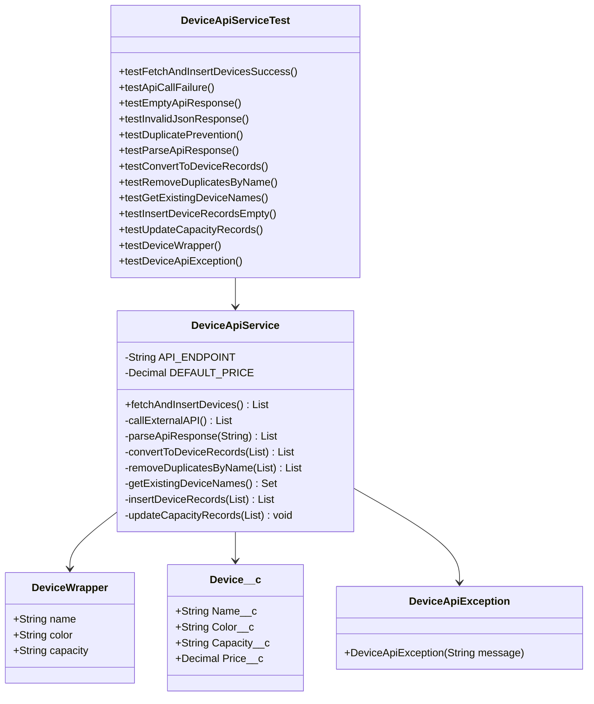
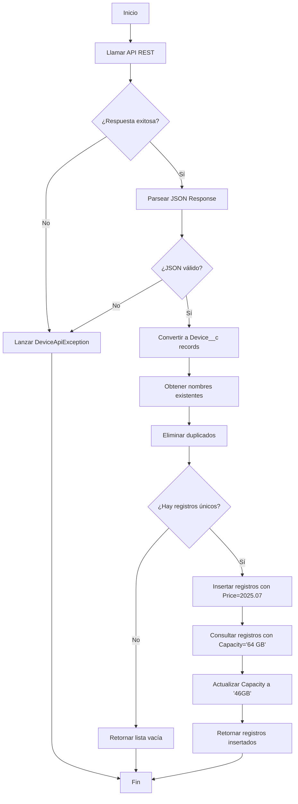

# Prueba Técnica Salesforce - API Integration

  

##  Descripción del Proyecto

  

Esta prueba técnica implementa una solución completa para consumir una API REST externa y gestionar los datos en Salesforce, cumpliendo con los siguientes requisitos:

  

-  Consumir API: `https://api.restful-api.dev/objects`

-  Crear Custom Object `Device__c` con campos específicos

-  Evitar registros duplicados por nombre

- Insertar registros con precio fijo de 2025.07

-  Actualizar capacidad de "64 GB" a "46GB"

-  Test Class con >80% de cobertura

-  Documentación técnica con UML

  

##  Arquitectura de la Solución

  

### Componentes Principales

  

1.  **Custom Object**: `Device__c`

2.  **Service Class**: `DeviceApiService.cls`

3.  **Test Class**: `DeviceApiServiceTest.cls`

  

### Diagrama de Clases (UML)

  



  

### Diagrama de Flujo de Proceso (BPMN)

  



  

##  Estructura de Datos

  

### Custom Object: Device__c

  

| Campo | Tipo | Descripción | Restricciones |

|-------|------|-------------|---------------|

| `Name__c` | Text(255) | Nombre del dispositivo | Required, Unique |

| `Color__c` | Text(255) | Color del dispositivo | Optional |

| `Capacity__c` | Text(255) | Capacidad de almacenamiento | Optional |

| `Price__c` | Currency(18,2) | Precio del dispositivo | Optional |

  

### API Response Structure

  

```json

[

{

"id": "1",

"name": "Google Pixel 6 Pro",

"data": {

"color": "Cloudy White",

"capacity": "128 GB"

}

},

{

"id": "2",

"name": "Apple iPhone 12 Mini",

"data": null

},

{

"id": "3",

"name": "Apple iPhone 12 Pro Max",

"data": {

"color": "Cloudy White",

"capacity GB": 512

}

},

{

"id": "4",

"name": "Apple Watch Series 8",

"data": {

"Strap Colour": "Elderberry",

"Case Size": "41mm"

}

}

]

```

  

### Manejo Inteligente de API Response

  

La implementación maneja múltiples variaciones en la estructura de datos:

  

| Escenario | Manejo |

|-----------|--------|

| `"data": null` | Se maneja sin errores, campos quedan como null |

| `"color"` vs `"Color"` | Búsqueda insensible a mayúsculas/minúsculas |

| `"capacity": "64 GB"` | Extracción directa como string |

| `"capacity GB": 512` | Conversión numérica + adición de "GB" |

| `"Strap Colour"` | Campos alternativos para color |

| Campos faltantes | Valores null sin errores |

  

##  Implementación Técnica

  

### 1. Service Class: DeviceApiService

  

**Características principales:**

- Patrón Service Layer para separación de responsabilidades

- Manejo robusto de errores con excepciones personalizadas

- Prevención de duplicados con verificación de nombres existentes

- Operaciones DML con manejo de errores parciales

- Métodos `@TestVisible` para facilitar testing

-  **Parsing inteligente** de campos con múltiples nombres y tipos

-  **Manejo de data null** en respuestas de API

-  **Extracción flexible** de color y capacidad con diferentes formatos

  

**Métodos clave:**

-  `fetchAndInsertDevices()`: Método principal que orquesta todo el proceso

-  `callExternalAPI()`: Realiza la llamada HTTP a la API externa

-  `parseApiResponse()`: Parsea la respuesta JSON de la API con manejo inteligente

-  `extractColorFromData()`: Extrae color de múltiples nombres de campo posibles

-  `extractCapacityFromData()`: Extrae capacidad manejando strings y números

-  `removeDuplicatesByName()`: Evita insertar registros duplicados

-  `updateCapacityRecords()`: Actualiza capacidades específicas

  

### 2. Test Class: DeviceApiServiceTest

  

**Cobertura de Testing:**

-  Escenarios de éxito completos

-  Manejo de errores de API (HTTP 500)

-  Respuestas vacías de la API

-  JSON malformado

-  Prevención de duplicados

-  Testing de métodos individuales

-  Testing de clases wrapper y excepciones

-  Mocking de HTTP callouts

  

  

##  Ejecución de la Solución

  

### Opción 1: Developer Console

```apex

// Ejecutar en Anonymous Apex

List<Device__c> result = DeviceApiService.fetchAndInsertDevices();

System.debug('Dispositivos procesados: ' + result.size());

```

  

### Opción 2: Salesforce CLI

```bash

# Ejecutar script apex

sf  apex  run  --target-org  myDevOrg  --file  scripts/apex/runDeviceSync.apex

```

  

### Verificación de Resultados

  

1.  **Verificar registros insertados:**

```sql

SELECT Id, Name__c, Color__c, Capacity__c, Price__c

FROM Device__c

ORDER BY CreatedDate DESC

```

  

2.  **Verificar actualización de capacidad:**

```sql

SELECT Id, Name__c, Capacity__c

FROM Device__c

WHERE Capacity__c =  '46GB'

```

  

  

### Configuración de Remote Site

```xml

<!-- En Setup > Remote Site Settings -->

<RemoteSiteSetting>

<fullName>RestfulApiDev</fullName>

<description>API para dispositivos</description>

<url>https://api.restful-api.dev</url>

<isActive>true</isActive>

</RemoteSiteSetting>

```